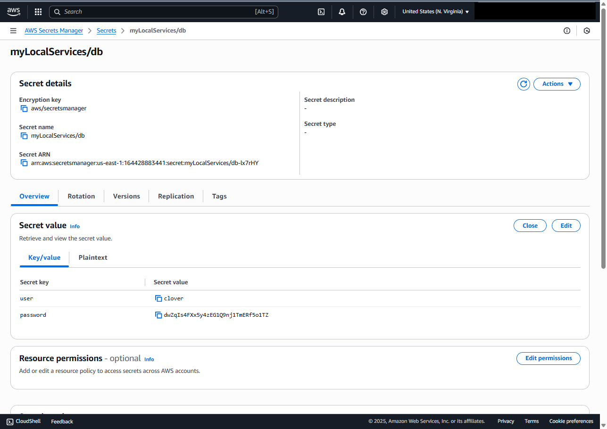
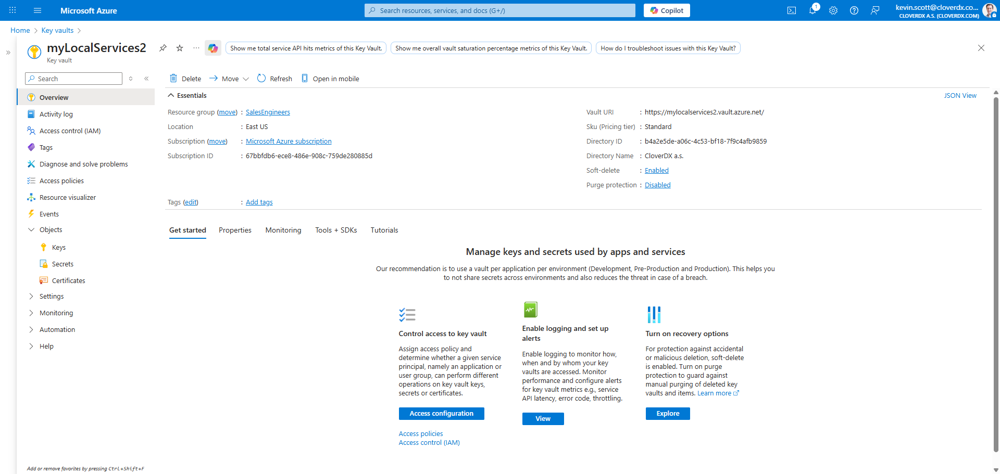
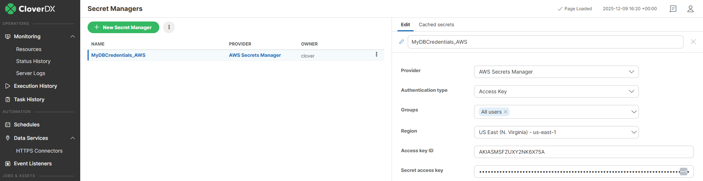
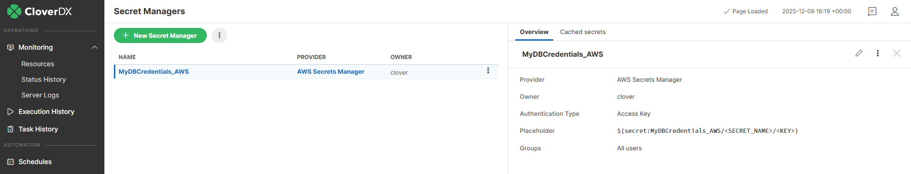
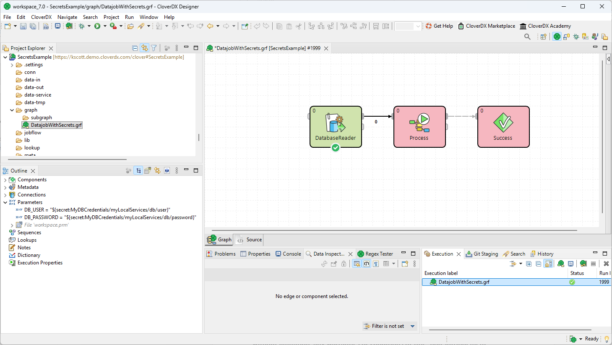

# UsingSecrets

This project shows two simple examples of storing sensitive data access credentials in third party Secret Managers from AWS and Azure.

# Configuration
The graphs in this project make reference to secrets stored in AWS and Azure. In order to experiment with this project you will need access to an AWS Secret Manager or Azure Keyvault, and you will need to to deploy this project on a CloverDX Server that is set up to make reference to your AWS or Azure secrets.

## Setting up Secrets
Create a secret in either AWS or Azure. 

<figure>
  <table>
    <tr>
      <td>
			
      </td>
     </tr>
     <tr>
      <td>
        	
      </td>
    </tr>
  </table>
<figcaption>Creating a secret in AWS Secret Manager or Azure Keyvault</figcaption>
</figure>

## Configuring CloverDX Server to reference your secrets
Once you have access to secrets in AWS or Azure, you need to configure CloverDX Server to make reference to those secrets.

<figure>
  <table>
    <tr>
      <td>
			
      </td>
     </tr>
     <tr>
      <td>
        	
      </td>
    </tr>
  </table>
<figcaption>Creating references to secrets in CloverDX Server</figcaption>
</figure>

## Configuring your data jobs to use secrets
Finally, deploy your project to your CloverDX Server and make reference to the secrets, typically in parameter definitions.
<figure>
	
	<figcaption>Using secret references in CloverDX Designer</figcaption>
</figure>

## Usage and licensing

Feel free to reuse or fork these projects in your own CloverDX solutions.

Note that the code in this repository is provided on an **"as is" basis, without
warranties or conditions of any kind, either express or implied, including,
without limitation, any warranties or conditions of title, non-infringement,
merchantability, or fitness for a particular purpose.**
Unless otherwise specified, the code in this repository is licensed under
[Apache 2.0 license](https://www.apache.org/licenses/LICENSE-2.0).

## Contributing

We welcome your feedback and contributions. You can:
- submit comments or pull requests here on GitHub,
- reach out to us through [cloverdx.com](https://www.cloverdx.com).

